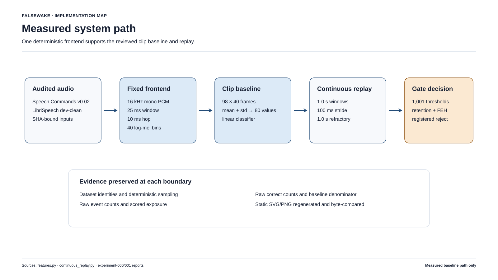
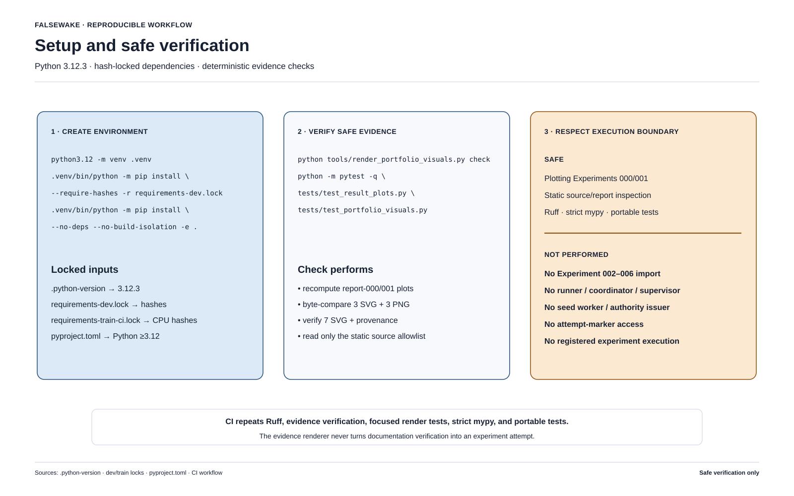
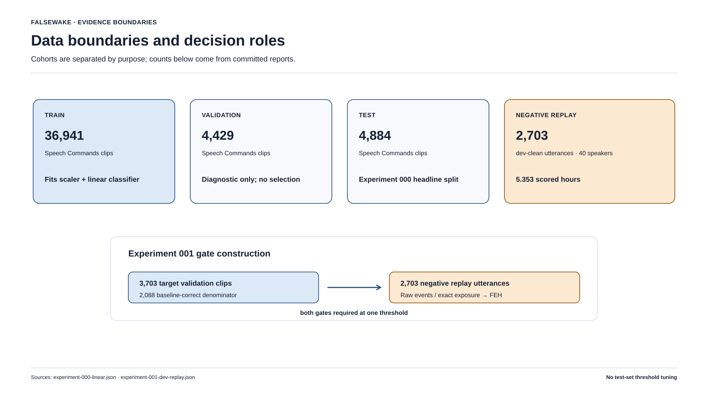
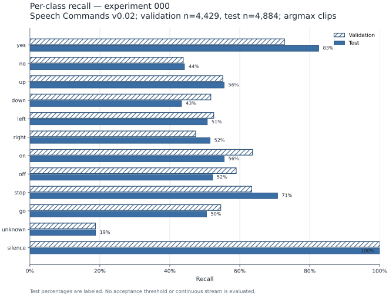
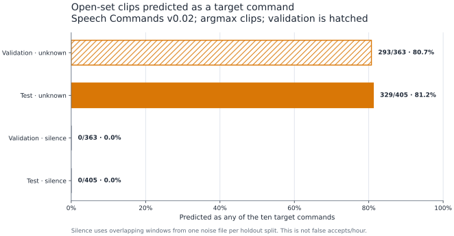
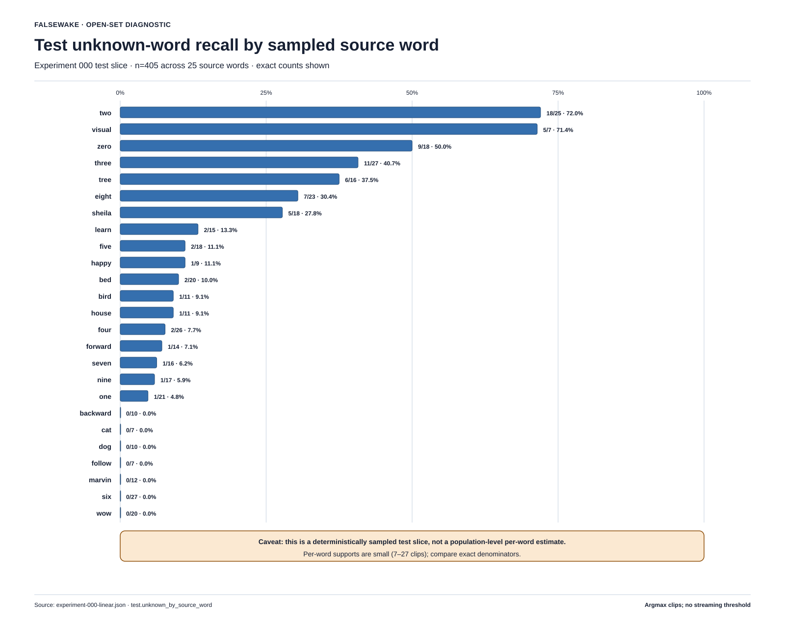
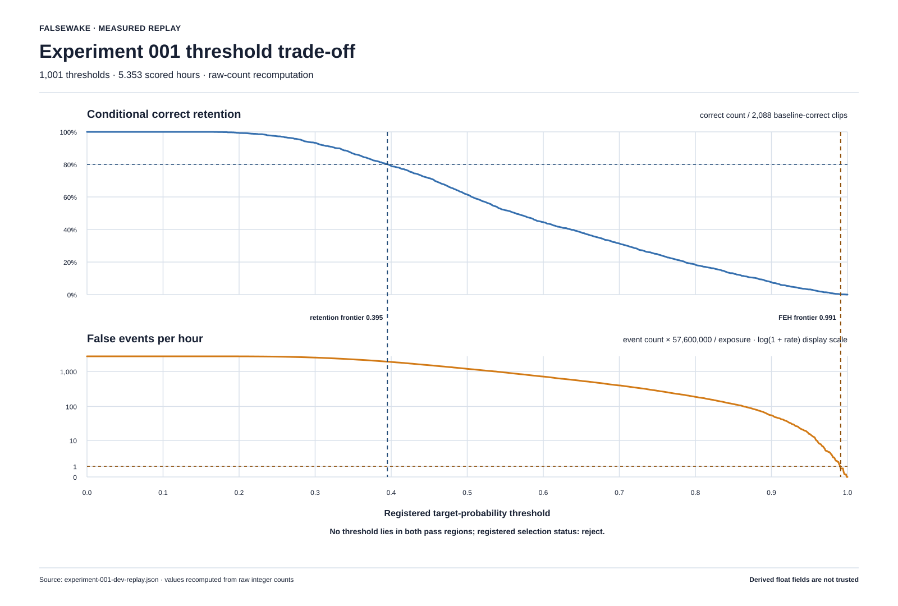
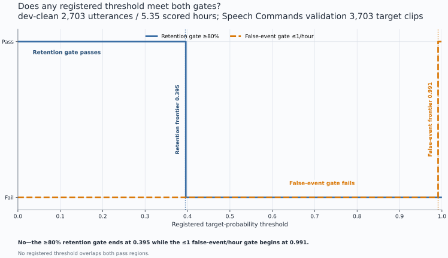
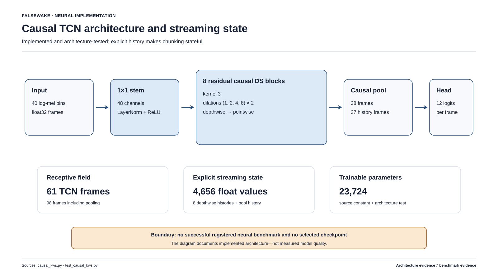
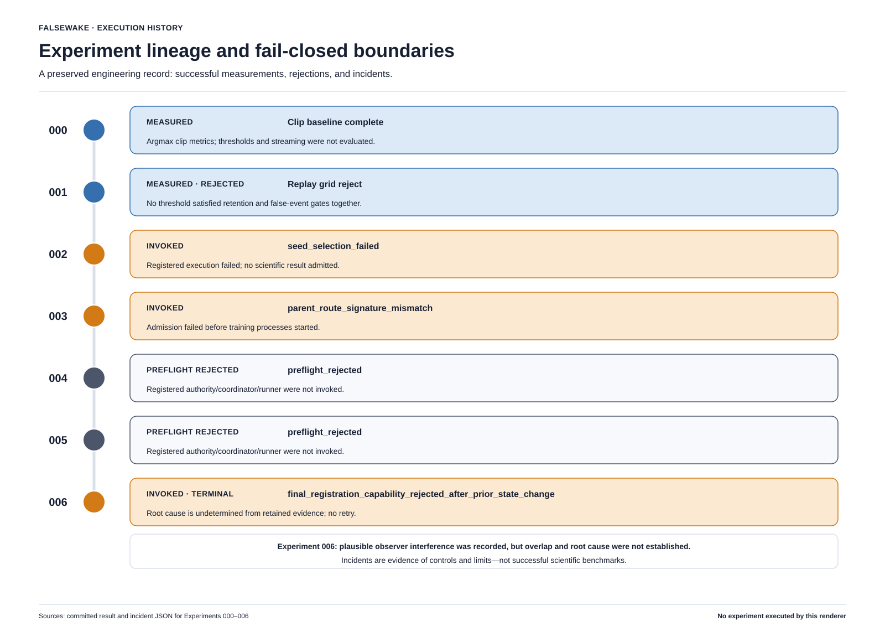

# FalseWake

**A streaming, open-set keyword-spotting research system that measures the
failure mode a clip benchmark hides: false activations on continuous, unrelated
speech.**

FalseWake follows a small CPU-oriented listener from audited audio, through a
deterministic log-mel frontend and classifier, into continuous replay, event
formation, threshold selection, holdout isolation, and machine-readable evidence.
The result is deliberately honest: the measured linear floor does not satisfy the
registered operating gates, while the later neural execution lineage produced no
valid neural metric or reusable checkpoint.



This repository is as much about experimental systems engineering as it is about
audio ML. It demonstrates explicit streaming state, open-set evaluation,
speaker-aware uncertainty, deterministic artifact generation, fail-closed data
boundaries, and an immutable record of unsuccessful execution attempts.

## What is actually established

Only Experiments 000 and 001 contain model-quality measurements. Experiments
002–006 are a closed neural execution lineage: they preserve implemented
architecture and execution-protocol work, but do not yield a neural benchmark,
model, checkpoint, ONNX result, or continuous-replay score.

| Experiment | Evidence-backed outcome |
| --- | --- |
| 000 | Completed 12-class linear clip baseline on Speech Commands v0.02 |
| 001 | Completed development replay over LibriSpeech `dev-clean`; all 1,001 registered thresholds rejected |
| 002 | One registered invocation ended in execution failure; no admitted history, neural score, or reusable checkpoint |
| 003 | One registered invocation failed admission before training; no scientific artifact |
| 004 | Rejected at pre-registration verification; never registered or run |
| 005 | Rejected at pre-registration verification; never registered or run |
| 006 | One registered invocation ended in terminal authority failure; no scientific result or reusable checkpoint |

The distinction matters: tested code and frozen plans are engineering evidence,
not performance evidence.

## Quickstart: inspect the evidence without running an experiment

Python 3.12.3 is recorded in [`.python-version`](.python-version). This path
installs the hash-locked dependencies for the portable `[dev]` environment from
[`requirements-dev.lock`](requirements-dev.lock), regenerates the measured result
plots into a temporary directory, runs a small safe test slice, and checks the
README evidence visuals.



```console
python3.12 -m venv .venv
source .venv/bin/activate
python -m pip install --require-hashes -r requirements-dev.lock
python -m pip install --no-deps --no-build-isolation --editable .

plots_dir="$(mktemp -d)"
falsewake-plots \
  --replay-report reports/experiment-001-dev-replay.json \
  reports/experiment-000-linear.json \
  "$plots_dir"

python -m pytest -q -W error -p no:cacheprovider \
  tests/test_features.py \
  tests/test_continuous_replay.py \
  tests/test_result_plots.py

python tools/render_portfolio_visuals.py check
```

These commands do **not** download either corpus, train a model, access
`test-clean`, create an attempt marker, or invoke any registered neural
experiment. `falsewake-plots` reads the checked-in Experiment 000/001 reports.

## From source audio to a registered decision

FalseWake keeps acquisition, model scoring, event accounting, and selection as
separate reviewable stages:

1. Audit archive structure, split membership, speaker identities, and decoded
   payloads.
2. Convert 16 kHz mono PCM into deterministic 40-bin log-mel frames.
3. Produce either an 80-value clip summary for the measured linear floor or
   frame logits plus explicit state for the implemented causal candidate.
4. Replay unrelated speech in time order rather than treating windows as
   independent classification examples.
5. Turn qualifying windows into events with a registered refractory rule.
6. Evaluate every point on the frozen threshold grid against positive-retention
   and negative-stream gates.
7. Publish the complete curve and a hash-bound selection artifact—even when the
   decision is `reject`.

The measured Experiment 001 path uses one-second windows every 100 ms. A
qualifying target argmax emits an event, then starts a global one-second
refractory period within that utterance. State resets at utterance boundaries;
there is no temporal smoothing or post-hoc event merging in this baseline replay.

## Data boundaries



The project does not redistribute audio. It records source identities, relative
manifest entries, decoded-payload digests, split rules, and aggregate evidence.

- **Speech Commands v0.02** supplies the ten target commands plus `unknown` and
  sampled `silence`. The source audit found 105,829 command clips: 84,843 train,
  9,981 validation, and 11,005 test, with 2,618 derived speakers disjoint across
  partitions. Experiment 000's deterministic sample contains 36,941 train,
  4,429 validation, and 4,884 test examples.
- **LibriSpeech `dev-clean`** is continuous negative development speech. It is
  never a positive-command source. Experiment 001 scored 2,703 utterances from
  40 speakers over 5.352611 hours of full-window exposure.
- **LibriSpeech `test-clean`** is a protected holdout. The registered development
  grid was rejected, so the selection artifact contains a null threshold and
  the holdout loader remains closed. The archive is absent and unread.
- **The planned neural phase** allowed Speech Commands train audio to contribute
  gradients and allowed validation data to select a candidate. Speech Commands
  test audio and every LibriSpeech payload were forbidden from neural training,
  normalization, augmentation, calibration, and export selection.

The complete contamination rules, licenses, archive identities, and limitations
are in [docs/data.md](docs/data.md).

## Experiment 000: establish the clip-level floor

The measured baseline is a multinomial logistic regression over 80 statistics:
per-band mean and population standard deviation from a fixed 40-bin log-mel
frontend. Its checked-in portable JSON model is 33,314 bytes.

| Speech Commands test metric | Measured result |
| --- | ---: |
| Examples | 4,884 |
| Correct classifications | 2,755 |
| Accuracy | 56.4087% |
| Macro F1 | 0.557591 |
| Target-command argmax errors | 1,800 / 4,074 (44.1826%) |
| `unknown` clips predicted as a target | 329 / 405 (81.2346%) |
| `silence` clips predicted as a target | 0 / 405 (0%) |

The aggregate accuracy is not the main lesson. The open-set rows show why a
seemingly serviceable clip score can be unusable as an always-listening system.





The `unknown` label contains 25 different source words, and its errors are highly
non-uniform. Keeping the lexical breakdown visible prevents a single aggregate
from hiding words with zero observed unknown recall. In total, 76 / 405 sampled
unknown clips were classified as `unknown`; seven source words had zero observed
recall, while the largest observed slice was `two` at 18 / 25 (72%). Supports are
unequal, so this is a sampled lexical diagnostic rather than a population ranking.



The zero target-prediction count on `silence` needs a strict caveat: all 405 test
silence examples are overlapping windows drawn from one held-out background-noise
recording. They are correlated examples, not evidence of broad acoustic or
real-world silence robustness.

The canonical sources are the
[metrics report](reports/experiment-000-linear.json), the
[sampling record](reports/experiment-000-sampling.json), the
[feature reproducibility record](reports/experiment-000-features.json), and the
[portable model](models/experiment-000-linear.json).

## Experiment 001: measure the threshold trade-off

Experiment 001 freezes 1,001 thresholds from `0.000` through `1.000`. On the
positive side, conditional retention uses the 2,088 validation target clips that
the linear model classified correctly at threshold zero. On the negative side,
the rate denominator is 308,310,400 scored samples—5.352611 hours—across the
complete `dev-clean` development population.



The registered threshold had to retain at least 80% of those 2,088 baseline-correct
decisions **and** produce at most 1.0 false event per scored hour.

| Decision frontier | Raw evidence | Derived result |
| --- | --- | ---: |
| Highest threshold preserving the retention gate: `0.395` | 1,674 / 2,088 retained; 10,147 development events | 80.1724% retention; 1,895.7103 false events/hour |
| First threshold satisfying the negative gate: `0.991` | 3 / 2,088 retained; 4 development events | 0.14368% retention; 0.74730 false events/hour |

The frontiers are 596 milli-threshold steps apart. No registered grid point
satisfies both constraints, so the durable decision is `reject` and
`selected_threshold_milli` is `null`.

[](reports/experiment-001-analysis.html)

This is a **development-only negative result**. `dev-clean` is clean read speech,
not a complete background-noise or production-device benchmark. The result only
rejects the registered 0.001-spaced grid under the registered event rule; it does
not prove that every real-valued threshold or every temporal decoder must fail.

Two complete replays used independent byte-identical input copies and different
`PYTHONHASHSEED` values. They produced byte-identical replay and selection
artifacts. Review the full
[1,001-row replay report](reports/experiment-001-dev-replay.json),
[selection artifact](reports/experiment-001-selection.json),
[reproducibility record](reports/experiment-001-reproducibility.json), or
[portable analysis](reports/experiment-001-analysis.html).

## Implemented causal candidate: architecture, not a result

Experiment 002 replaces the clip summary with a streaming causal network. The
implementation accepts an arbitrary feature chunk and returns frame logits plus
the next explicit state.



The registered design consists of:

- a 48-channel stem;
- eight residual depthwise-separable causal blocks with dilations
  `1, 2, 4, 8, 1, 2, 4, 8`;
- per-frame channel normalization, with no BatchNorm;
- a fixed mean over the current and previous 37 encoder frames;
- a 12-class linear head; and
- exactly 23,724 trainable parameters.

Its output receptive field is 98 frontend frames, or 15,920 samples (995 ms).
Streaming state contains eight convolution histories, a `[B, 48, 37]` pooling
history, and a saturating `int64` frame counter; float state occupies 18,624 bytes
per batch element (4,656 `float32` values). Frame 97 is the first eligible score,
followed by every tenth frame.

The explicit-state interface makes several hard properties testable: one-frame,
irregular-chunk, and full-sequence execution must agree; appending future frames
cannot change an already emitted prefix; and state resets only at an utterance
boundary. These are implementation and test-contract properties. Because the
execution lineage never published an admitted checkpoint, they are not neural
accuracy, latency, export, or deployment results.

## The neural execution lineage

Failed attempts are first-class evidence here. Each new profile preserved the
scientific plan while attempting to repair a separately identified execution or
admission defect. The lineage is closed; it is not a queue of experiments that a
visitor should rerun.



| Experiment | Terminal boundary | What may be claimed |
| --- | --- | --- |
| 002 | Registered execution failed during seed selection after one invocation | Canonical execution-failure report; no admitted history, score, export, benchmark, or checkpoint |
| 003 | Registered admission rejected a live route-signature mismatch | No training process, optimizer update, validation example, artifact, or reusable checkpoint |
| 004 | Frozen preflight contract proved internally unsatisfiable | No registration, invocation, marker, optimizer update, or validation example |
| 005 | Frozen normalization recipe could not express the truthful profile-005 docstring | No registration, invocation, marker, optimizer update, or validation example |
| 006 | One registered invocation failed its final authority verification | Terminal incident only; no automatic report, published artifact, scientific result, or reusable checkpoint |

> **Experiment 006 evidence boundary:** retained post-exit state does not establish
> whether seed children or training processes started, how many optimizer updates
> occurred, or whether any validation examples were evaluated. The root cause is
> undetermined. A concurrent `git status --short` is a plausible mechanism for
> observer interference, but temporal overlap with the failing reverification was
> not established; it is not a proven cause.

Primary records:
[Experiment 002 outcome](reports/experiment-002-training.json),
[Experiment 002 incident](reports/experiment-002-execution-incident.json),
[Experiment 003 incident](reports/experiment-003-execution-incident.json),
[Experiment 004 preflight](reports/experiment-004-preflight-incident.json),
[Experiment 005 preflight](reports/experiment-005-preflight-incident.json), and
[Experiment 006 incident](reports/experiment-006-execution-incident.json).

## Reproducibility and evidence design

The repository is designed so that a negative or failed outcome remains auditable:

- Two fresh feature extractions over the same 46,254 sampled clips produced the
  same `46,254 × 80` `float32` matrix bytes.
- The portable linear report binds its manifest, examples, features, model,
  experiment configuration, and runtime.
- Experiment 001 retains raw event counts and scored exposure for all 1,001
  thresholds, nominal Garwood intervals, speaker-cluster bootstrap intervals, and
  exact positive denominators.
- Two development replays produced byte-identical reports and selection
  artifacts.
- The `reject` selection artifact keeps the `test-clean` supplier behind a
  fail-closed boundary.
- Preflight and registered-execution failures remain in machine-readable incident
  records instead of being overwritten by a more attractive attempt.
- README figures are generated from tracked source, configuration, and evidence
  files; the evidence check rejects stale output rather than accepting appearance
  alone. Their source digests, derived facts, and explicit non-claims are recorded
  in the [visual provenance manifest](docs/images/readme/provenance.json).

For the repository-level static checks and portable test selection, see
[the CI workflow](.github/workflows/ci.yml). The local evidence-visual integrity
check is:

```console
python tools/render_portfolio_visuals.py check
```

CI installs the portable environment from
[`requirements-dev.lock`](requirements-dev.lock). Its CPU-only causal-architecture
checks add the CPython 3.12 / Linux x86-64 packages pinned in
[`requirements-train-ci.lock`](requirements-train-ci.lock); that platform-specific
lock is not needed for the evidence-only quickstart above.

## Data-backed workflows

The quickstart intentionally stays on checked-in evidence. Reproducing dataset
audits or model fitting requires separately obtained corpora and explicit paths.
The package exposes:

| Command | Role |
| --- | --- |
| `falsewake-manifest` | Audit Speech Commands and build the speaker-aware manifest |
| `falsewake-features` | Materialize deterministic log-mel summary features |
| `falsewake-linear` | Fit and evaluate the portable linear floor |
| `falsewake-librispeech` | Audit LibriSpeech development inputs |
| `falsewake-replay` | Run registered continuous replay and selection |
| `falsewake-plots` | Render figures from checked-in result reports |

The exact scientific contracts are documented in
[Experiment 000](docs/experiment-000.md),
[Experiment 001](docs/experiment-001.md), and
[Experiment 002](docs/experiment-002.md). The later documents preserve the
execution-recovery history:
[003](docs/experiment-003.md),
[004](docs/experiment-004.md),
[005](docs/experiment-005.md), and
[006](docs/experiment-006.md).

## Project map

| Path | Purpose |
| --- | --- |
| [`src/falsewake/features.py`](src/falsewake/features.py) | Deterministic 16 kHz log-mel frontend |
| [`src/falsewake/causal_kws.py`](src/falsewake/causal_kws.py) | Explicit-state causal TCN |
| [`src/falsewake/continuous_replay.py`](src/falsewake/continuous_replay.py) | Streaming window scores, events, uncertainty, and threshold gates |
| [`src/falsewake/speech_commands.py`](src/falsewake/speech_commands.py) | Source audit and speaker-aware manifest |
| [`src/falsewake/librispeech.py`](src/falsewake/librispeech.py) | LibriSpeech archive and decoded-PCM audit |
| [`src/falsewake/holdout.py`](src/falsewake/holdout.py) | Fail-closed selection and holdout boundary |
| [`src/falsewake/result_plots.py`](src/falsewake/result_plots.py) | Report-backed figure generation |
| [`tools/render_portfolio_visuals.py`](tools/render_portfolio_visuals.py) | Deterministic, evidence-bound README visual renderer |
| [`configs/`](configs/) | Frozen scientific and execution contracts |
| [`reports/`](reports/) | Metrics, selections, reproducibility records, and incidents |
| [`tests/`](tests/) | Numeric, streaming, data-boundary, and execution-protocol tests |

## Non-claims and limitations

FalseWake does not claim:

- production wake-word performance or superiority over an existing engine;
- robustness across rooms, microphones, accents, music, noise, or adversarial
  speech;
- a final false-activation estimate from LibriSpeech `test-clean`;
- independence for the overlapping silence windows drawn from one noise file;
- a trained, exported, benchmarked, or reusable causal neural model;
- that Experiment 006's hidden execution progress is known; or
- that observer interference was the proven cause of its terminal failure.

Experiment 000 is a diagnostic floor. Experiment 001 is development evidence from
clean audiobook speech. The causal TCN is an implemented and tested architecture
whose registered executions yielded no scientific result.

## License and datasets

Code is released under the [MIT License](LICENSE). Audio datasets are not
redistributed; their original licenses and attribution requirements remain in
force. Source links, licenses, checksums, and intended roles are recorded in
[docs/data.md](docs/data.md).
