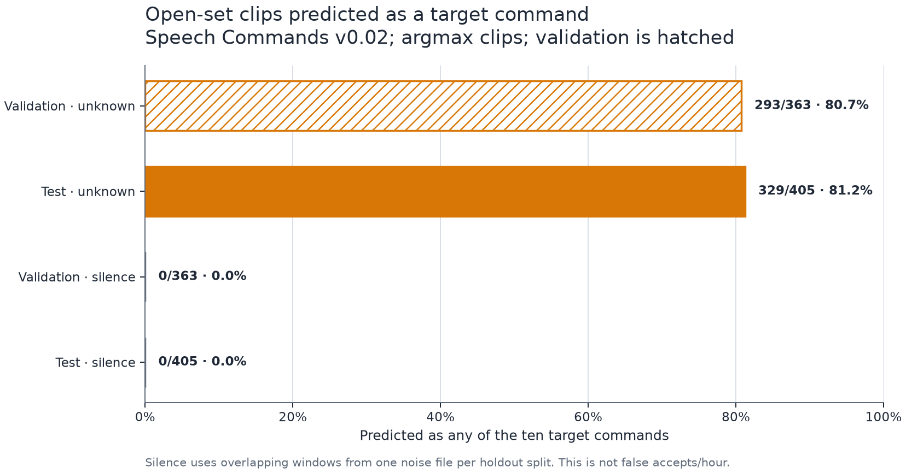

# Experiment 000: establish the floor

## Question

How badly does a straightforward clip classifier behave when its scores are replayed
over continuous unrelated speech?

## Baseline

A multinomial linear classifier receives fixed log-mel summary features from a
one-second, 16 kHz mono window. It predicts the ten target commands plus `unknown` and
`silence`. This is a diagnostic baseline, not the intended streaming model.

The frontend is fixed before fitting the classifier. Source PCM16 samples are decoded
as signed little-endian integers divided by 32,768, producing `float32` values in
`[-1, 1)`. The frontend admits finite normalized `float32` samples in the closed
`[-1, 1]` interval; integer-scale and out-of-range arrays are rejected.

- clips are right-padded to 16,000 samples without centering or end padding; floor
  framing leaves the final 80 samples outside the last frame;
- a periodic Hann window uses 400 samples (25 ms), a 160-sample hop (10 ms), and a
  512-point real FFT;
- 40 area-normalized HTK-spaced mel bands cover 20–7,600 Hz;
- squared FFT magnitudes are divided by 512 without one-sided-bin doubling or
  window-energy normalization;
- mel-filtered power is clipped at `1e-10` before the natural logarithm; and
- per-band mean and population standard deviation form an 80-value vector.

## Split and tuning rule

- Train only on the Speech Commands training partition.
- Convert cached `float32` features to C-contiguous `float64`, then fit scaler
  statistics on training rows only.
- Experiment 000 performs no hyperparameter selection: scaler and logistic settings
  are already fixed. Validation metrics are diagnostic and cannot change them.
- Evaluate clip classification on the Speech Commands test partition.
- Evaluate continuous false accepts once on LibriSpeech `test-clean` after selecting
  a configuration.
- Keep all utterances from a speaker in one partition.

## Clip sampling

Every target-command clip is retained. Within each split, the `unknown` count is the
lower median of the ten target-class counts; paths are selected by a seeded SHA-256
rank. The `silence` count matches `unknown`. Silence source files must belong to the
same split, and seeded SHA-256 bytes select the file and sample offset. Duplicate
offsets are retried, although one-second windows may still overlap.

Validation and test each have only one background source, so their overlapping
silence windows are correlated examples rather than independent trials. Clip metrics
will not attach confidence intervals to those rows. Unknown clips are sampled across
all 25 non-target words without lexical stratification; the report will therefore
include per-word support and recall instead of hiding sparse words inside one score.

This produces 36,941 training, 4,429 validation, and 4,884 test examples. The exact
class counts and selected-example digest are in
[reports/experiment-000-sampling.json](../reports/experiment-000-sampling.json). The
classifier settings are registered in
[configs/experiment-000.json](../configs/experiment-000.json) before fitting.

The registered clip evaluation uses the fixed 12-class order and an argmax
prediction. Macro F1 includes all 12 classes with zero division mapped to zero.
The target argmax error rate counts a target clip as wrong whenever its predicted
class differs from its label; it is not called a false reject rate because no
acceptance threshold exists in this phase. The report will also expose support and
predicted-`unknown` recall for each of the 25 source words inside the sampled
`unknown` class.

Training rows are selected by their explicit split value rather than their position
in the sampling plan. Score columns are mapped through `classifier.classes_`, which
need not match the report's class order. A convergence warning invalidates the run;
the fitted iteration count and exact configuration SHA-256 are stored with it.

## Reported numbers

- clip accuracy, 12-class macro F1, and per-class precision, recall, F1, and
  support;
- target-command argmax error rate and per-source-word `unknown` recall;
- the rate at which `unknown` and `silence` clips are predicted as any target;
- false reject rate and false accepts per hour only after the continuous replay
  threshold is registered;
- the number of evaluated negative hours and 95% Poisson confidence intervals;
- feature extraction and classifier latency on the project host; and
- a confusion matrix plus the highest-scoring false accepts.

## Decisions made before seeing results

- If the linear model cannot separate target clips at all, inspect the feature
  implementation before adding a neural model.
- If clip metrics look good but continuous false accepts are poor, keep that negative
  result as the motivation for the streaming model.
- Do not add architectures until the same waveform produces the same feature tensor
  under every supported chunking pattern.

## Results

The frozen classifier converged in 371 iterations without a convergence warning.
It used 36,941 training rows; validation was reported without selecting or changing
anything. The headline test result is deliberately modest:

| Split | Clips | Accuracy | Macro F1 | Target argmax error | `unknown` -> target | `silence` -> target |
| --- | ---: | ---: | ---: | ---: | ---: | ---: |
| Validation | 4,429 | 56.88% | 0.562 | 43.61% | 293 / 363 (80.72%) | 0 / 363 (0.00%) |
| Test | 4,884 | 56.41% | 0.558 | 44.18% | 329 / 405 (81.23%) | 0 / 405 (0.00%) |

Only 76 of 405 test `unknown` clips are predicted as `unknown` (18.77% recall),
and seven of the 25 source words have zero recall in that sampled slice. The model
therefore recognizes some isolated commands but is a poor open-set detector. This
is a useful negative floor for the streaming model, not a result to optimize away.

The zero target predictions for test `silence` must stay in context: all 405 clips
are overlapping windows with unique starts from one `white_noise.wav` recording.
They are correlated, cover little acoustic diversity, and say nothing about false
accepts per hour. No acceptance threshold, debounce rule, LibriSpeech audio, false
reject rate, or continuous-stream metric has been evaluated.

The complete confusion matrices, per-class metrics, and all 25 lexical slices are
in [reports/experiment-000-linear.json](../reports/experiment-000-linear.json).
The [per-class recall figure](../reports/experiment-000-class-recall.svg) compares
validation and test on a shared zero-based scale.
The scaler and linear weights are portable JSON in
[models/experiment-000-linear.json](../models/experiment-000-linear.json). An
independent refit reproduced the scaler, coefficients, iteration count, and every
prediction bit for bit; a separate NumPy calculation reproduced both metric sets.

Two full feature extractions of all 46,254 clips were also byte-identical. Their
timings, environment, and canonical digest are in
[reports/experiment-000-features.json](../reports/experiment-000-features.json).
The source audit covers 105,829 command clips and six partitioned background files.
